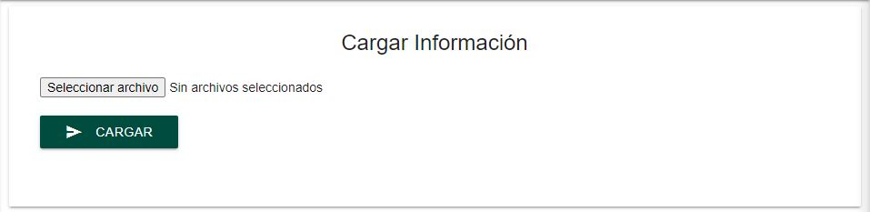

Alta
=====

La pestaña de **Alta** en el menú permite acceder al formulario de alta de licencias. Para subir los datos al sistema se deben realizar los siguientes pasos:

  
  

1. Ingresar los datos requeridos al archivo CSV dedicado, llamado **layout_licencias.csv**. *Es importante que se llenen todas las columnas*. 

2. Seleccionar el archivo mediante el botón *Seleccionar archivo* del formulario.

3. Dar clic en el botón *Cargar*.

4. Un mensaje indicará si la carga de datos fue exitosa o no. En caso de no ser exitosa, favor de revisar de nuevo el formato del archivo CSV.
