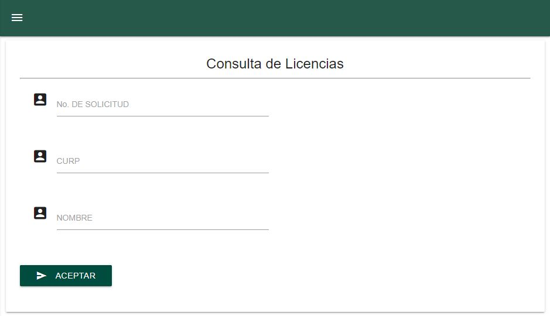

Consulta
=====

El formulario de consulta permite realizar una búsqueda en la base de datos mediante Número de Solicitud, CURP y Apellido Paterno. Al empezar a escribir en uno de los campos, no permitirá escribir en los demás.

Una vez se hayan ingresados los datos para la consulta, el usuario deberá dar clic en el botón **Buscar** para realizar la búsqueda.

Número de Solicitud
------------

El número de solicitud se compone de siete dígitos. Si el número coincide con alguno de los ya registrados, se mostrará en la tabla con todos los campos correspondientes a ese número de solicitud.

CURP
----------------

El formulario permite realizar la búsqueda mediante la CURP de quien haya realizado algún trámite. En la tabla se mostrarán todos los trámites que haya realizado esta persona. 

Para revisar la información completa referente al trámite, se puede dar clic en el botón de la columna **Información**.

Nombres y Apellidos 
----------------

El formulario permite realizar la búsqueda mediante el apellido paterno, materno o nombres de quien haya realizado algún trámite. Al ingresar alguna palabra, el sistema revisará si existen coincidencias con los apellidos y nombres registrados y las mostrará todas en la tabla.

Por ejemplo: 
   Buscar la palabra 'ez' regresará todos los apellidos y nombres que contengan esa palabra, no solamente al principio o al final.  
   
Una vez se visualizan los resultados en la tabla, una barra de búsqueda permitirá filtrar la información conforme a cualquiera de las columnas.
