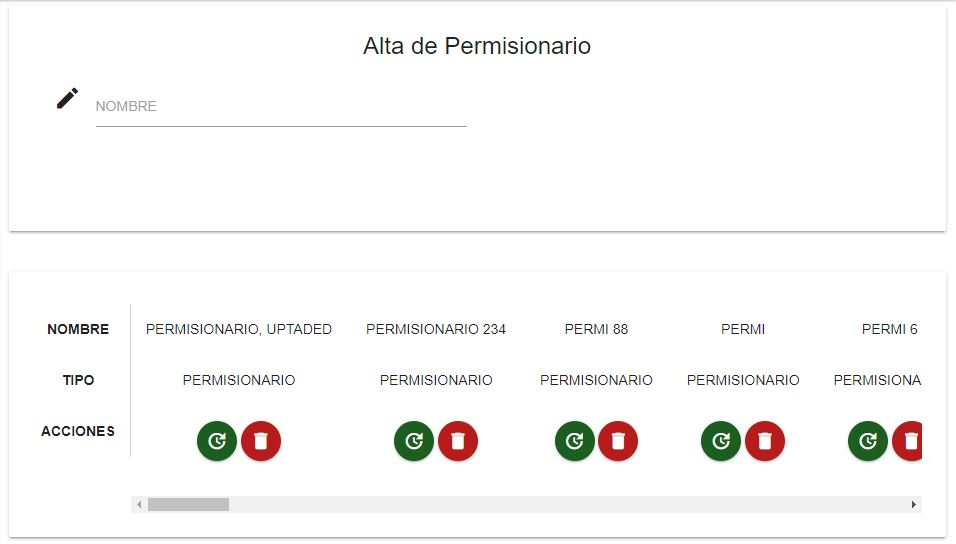

Permisionarios
==============

En el menú de la barra lateral de la página, seleccionar **REGISTROS -> ALTA PERMISIONARIOS**. Se desplegará el siguiente formulario.

  
Consulta
-------

En la parte inferior del formulario aparece una tabla con todos los permisionarios registrados. Mediante la barra de búsqueda puede filtrar los resultados.
La tabla contiene botones con acciones para cada permisionario. Es posible eliminar al permisionario o modificar su nombre.

Alta
-----

1. Para dar de alta un nuevo permisionario, ingrese el nombre deseado en el campo **NOMBRE**. Si el nombre ya existe dentro de la base de datos, el sistema no permitirá que lo registre.
2. Haga clic en el botón **ACEPTAR** para registrarlo. En caso de que hubiera algún error, el sistema lo notificará; de lo contrario el nuevo permisionario aparecerá en la tabla en la parte inferior del formulario.

Cambiar nombre de permisionario
------------------------------

1. Una vez ubicado el permisionario que se desea actualizar, haga clic en el botón verde en la columna de **ACCIONES** de la tabla de la parte inferior del formulario.
2. Aparecerá un formulario de Actualización. Ingrese el nuevo nombre y haga clic en **ACEPTAR**.

Eliminar permisionario
----------------------

1. Una vez ubicado el permisionario que se desea eliminar, haga clic en el botón rojo en la columna de **ACCIONES** de la tabla de la parte inferior del formulario. *Nótese que esta acción es permanente*.
2. El sistema notificará si se eliminó correctamente el permisionario.
