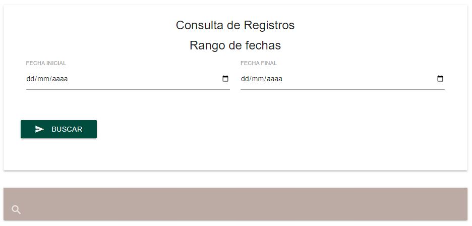

Tarifas
=======

Alta
----
.. image:: images/alta_tarifa.JPG
  :alt: tarifas
  :width: 600

1. En el menú de la parte izquierda de la aplicación, diríjase a **REGISTRO -> REG. TARIFAS**.
2. Tendrá que llenar todos los datos necesarios. Podrá seleccionar alguno de los permisionarios existentes.
3. Una vez terminado, haga clic en el botón **GUARDAR** para dar de alta el nuevo registro.
4. Podrá revisar el registro en :doc:`Consulta`.

Consulta
--------

  
Modificar y Eliminar
--------------------
.. image:: images/consulta_tarifa2.JPG
  :alt: tarifas
  :width: 600
